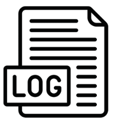

# LogMe
Minimal example of the python library 'logging'


## Description
In the file `MyLogger.py` you can find two types of loggers defined.
1. `LoggerFromConfig` is loading the conf stored in `loggers.conf` and set up a singleton logger with it
2. `Logger` contains the configuration within its object

Test the minimal example by running:

```python3.8.10
python app.py
```

The screen output should look like:

```
[INFO] [2022-06-28 17:44:20] [app.py:fun1:7] Hi!
[INFO - app.py:fun2]: Hi!
[INFO] [2022-06-28 17:44:20] [sum.py:sum:6] Sum of 2 and 3
[INFO] [2022-06-28 17:44:20] [app.py:<module>:17] 5
[INFO - subtract.py:subtract]: Subtracting 5 from 4
[DEBUG - app.py:<module>]: 1
```

Notice that both loggers are showing the result to screen. 
`LoggerFromConfig` have created a file in `logs/all_messages_conf.log` and should contain:

```
2022-06-28 17:44:20,277 : INFO : app.py : fun2 : 10 : (Process Details : (38783, MainProcess), Thread Details : (140499932923712, MainThread))\nLog : Hi!
2022-06-28 17:44:20,277 : INFO : subtract.py : subtract : 6 : (Process Details : (38783, MainProcess), Thread Details : (140499932923712, MainThread))\nLog : Subtracting 5 from 4
2022-06-28 17:44:20,277 : DEBUG : app.py : <module> : 18 : (Process Details : (38783, MainProcess), Thread Details : (140499932923712, MainThread))\nLog : 1
```

Feel free to use the loggers in `MyLogger.py` in your project.
Any feedback is appreciated!